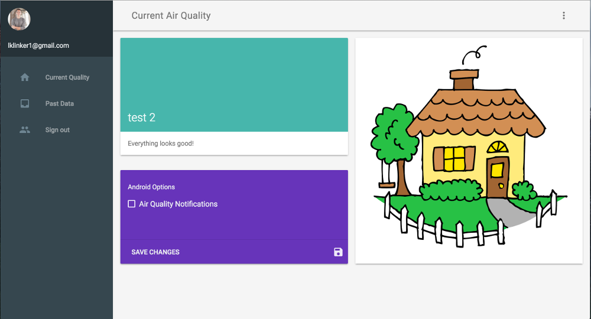

# Google App Engine Backend

This module is in charge of a number of different portions of the app:

- Web interface
- RESTful Endpoints
- Data analytics
- Auth token generation
- Datastore (Objectify - object bases, built into Google App Engine)
- Push notifications through Google Cloud Messaging

### Web Interface

Uses [Material Design Lite](https://getmdl.io/) for the interface. This web app will authenticate with your Google account, then display any associated information.

### RESTful Endpoints

The app contains endpoints for the following functionality:

User Accounts:  
- Register an account
- Remove an account
- List accounts (admin only)
- Remove all accounts (admin only)

Air Quality:  
- List previous data
- Insert new data
- Delete all data (admin only)

### Data Analytics

To analyze the data, we are just using a canned function that we created from some stock data that we received. For a production application, we would want to adjust this function over time to take into account the new data that our users are pushing to the backend.

